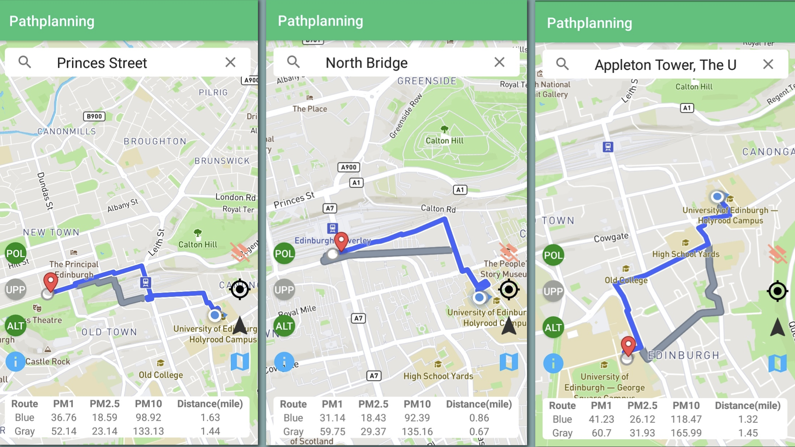

# Path-Planning-Least-polluted-routes
This is my MSc Dissertation: Least polluted routes.

## AIM
This project aims to develop an Android mobile application to help people plan journeys which takes air pollution as concern in finding the least polluted routes between places. Algorithms including Dijkstra, A* and Bidirectional A* were investigated.

## Android application
* In folder "Android_Application"
* Use Android studio to run and install the application in mobile phones

## Google Maps service and Mapbox access tokens
The map service of this Android application require Mapbox access tokens (displaying the map) as well as Google Maps services (searching locations). 

To get your Mapbox access tokens, follow the tutorial as below:

https://docs.mapbox.com/help/how-mapbox-works/access-tokens/#how-access-tokens-work

The mapbox access token key should be placed at "**res/values/string.xml**" file for string name "**access_token**".

To optain an API Key for your Android application, please follow the tutorial as below:

https://developers.google.com/maps/documentation/android-sdk/get-api-key

The google API Key is assigned for a String variable called "**apiKey**" in function "**setupAutoCompleteFragment**" in "**MainActivity**"

## Least polluted route server 
The least polluted route server (lpr-server) is responsible for running path planning algorithms as well as sending the path in JSON to android application.

The server file are in "lpr-server" folder

In terminal, cd into the folder "lpr-server", then run following code to deploy the server in google cloud:
```linux
cd lpr-server
mvn clean package appengine:deploy
```
Make sure that you have configured your own google cloud app engine envionment. See tutorials in here: https://cloud.google.com/appengine/docs/java/

To test the lpr-server locally, run it with
```linux
mvn spring-boot:run
```

## DATA

* Map data: in folder "Data/MAPS", "ExtractNodes.ipynb" can extract nodes and adjacency lists from .osm file.
* GAN: GANs.ipynb can generate 160 x 160 grid of pollution data from 20 x 20 grid of pollution data. 20 x 20 grid of pollution data were in folder "kernel_size_(1,2,3)/valid date/PM2.5-prediction.csv"

## Experiment result
The experiment results are in folder "ExperimentsResult"

## UI
In Figure below, the application contains seven buttons on two sides, a search bar on the top and a table along on bottom. On the right side, the first button (a pink icon) is used to clear the generated route on the map. The second black button (a GPS icon) is used to locate the device. The third button (a black navigation icon) can start planning the route when a destination is selected. The last blue button (a map icon) is used to show heat map of a route. On the left side, the first three buttons is mainly used for testing the functionality of the server. The buttons with texts "POL", "UPP" and "ALT" tell the server: "POL": Button ON tells server to plan the least polluted route; OFF means planning the shortest route. "UPP": Button ON means updating the pollution data; OFF means using current pollution data."ALT": Button ON means generating an alternative route.
When a location was selected in a list of results in the search bar, the view of the map will zoom in at the selected location (See the third picture in Figure 5.8); Once a destination is decided, a route will be generated by pressing the navigation button and the information of the route (PM, distance) will be displayed in a table on the bottom. This table can be shown/hidden by pressing the last blue button on the left(an exclamation mark icon).


Least polluted routes with alternative routes generated from 9D Holyrood road to Princes Street, North Bridge and the Appleton tower


